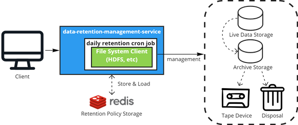
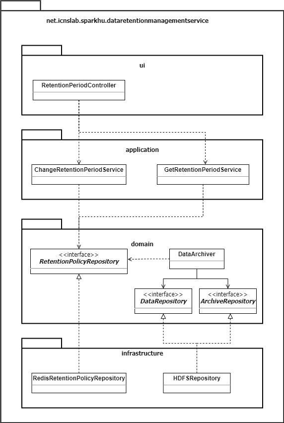

# data retention management service

해당 프로젝트는 데이터 레이크의 용량 부담을 덜고자 데이터 보존 정책을 외부화하여 관리하는 시스템입니다.



## 1. 주요 기능
1. 매일 자정에 Live data storage에서 Archive storage로 백업 정책에 따라 백업 작업을 수행합니다.
2. 백업 작업이 완료되면 정책에 따라 Secondary Storage로 이동이나 폐기 작업을 수행합니다.
3. 해당 서비스는 클라이언트로부터 정책 변경 요청을 받아 Redis Policy Storage를 갱신합니다.

해당 서비스의 패키지 다이어그램은 다음과 같습니다.

## 2. 시작하기 전 준비사항
이 프로젝트는 JRE 1.8 에서 동작하도록 개발하였습니다.<br>
또한 Policy Storage를 위한 Redis 구성이 외부에 필요합니다.

- JRE >= 1.8
- maven

- Redis

※ (참조) Redis Docker Container 배포
``` sh
$ docker pull redis:alpine
$ docker network create redis-net
$ docker run --name {YOUR_CONTAINER_NAME} -p {YOUR_PORT}:6379 --network redis-net -v {YOUR_VOLUME} -d redis:alpine redis-server —appendonly yes

# (Optional) Redis-cli 접속 확인
$ docker run -it --network redis-net --rm redis redis-cli -h {YOUR_CONTAINER_NAME}
```

## 3. 시작하기
### 3.1 프로젝트 클론
다음과 같이 프로젝트를 받아주세요.
``` sh
$ mkdir {YOUR_DESIRED_PATH} && cd {YOUR_DESIRED_PATH}
$ git clone https://github.com/Sparkhu/data-retention-management-service.git
$ cd data-retention-management-service
```
### 3.2 property 파일 입력
서비스가 동작하기 위해 `src/main/resource/appication.properties` 파일에 다음 내용을 알맞게 입력해주세요.
``` ini
spring.mvc.pathmatch.matching-strategy=ant_path_matcher
# springfox.documentation.swagger.use-model-v3=false

spring.redis.host=
spring.redis.port=

storage.scheme=
storage.host=
storage.port=
storage.sources.dir=
storage.archive.dir=
storage.username=

yarn.resourcemanager.address = 
yarn.resourcemanager.scheduler.address = 

mapreduce.jobhistory.address = 
mapreduce.framework.name = 

hadoop.home = 
hadoop.user.name = 

retention.default.active.period = # such as 6 months
```
### 3.3 빌드
``` sh
$ mvn install -DskipTests
```

### 3.4 서비스 실행
``` sh
$ java -jar {BUILDED_JAR_FILE_NAME} 
# If you want to run background
$ nohup java -jar {BUILDED_JAR_FILE_NAME} &
```

## 4. 라이센스
This project is licensed under the terms of the [**APACHE LICENSE, VERSION 2.0**](https://www.apache.org/licenses/LICENSE-2.0.txt).
